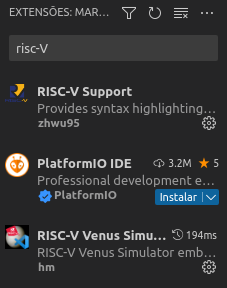

# Laboratório 5

Vamos trocar o simulador para realizar tarefas mais avançadas?

!!! tip "Dicas"
    * Você não precisa entregar nenhum código como resposta. Procure entender os conceitos e explorar as variações.
    * Você vai utilizar um novo simulador, chamado Venus, que pode ser executado online ou como plugin dentro do Visual Studio Code. Vamos utilizar preferencialmente a versão do VSCode pois tem mais componentes para praticarmos.
    * Não deixe de colocar comentários nos seus códigos. Procure organizar o código de forma que ele fique mais fácil de entender.
    * As dicas desse laboratório estão colapsadas. Para expandi-las, clique na pequena seta do lado direito da caixa de texto.

## Um pouco sobre o novo simulador

Cada simulador tem uma forma diferente de apresentar exatamente o mesmo processador. Cada instrução do RISC-V é codificada exatamente da mesma forma em qualquer lugar, mas a forma de apresentar o código assembly (como arquivo, copiando e colando) pode variar entre os simuladores. Vamos instalar o plugin do VSCode e ver como ele funciona?

Abra o VSCode e busque pelo plugin **RISC-V Venus Simulator**. Instale o plugin e reinicie o VSCode (se necessário). Se não instalou ainda, recomendo também instalar o plugin **RISC-V Support**, para melhor visualizar seu código. As duas extensões estão indicadas na figura abaixo:



A partir de agora, você pode utilizar o próprio editor do VSCode e o comando de depurar (Menu **Executar > Iniciar Depuração**, ou apertar **F5**) ou executar (Menu **Executar > Iniciar Sem Depuração**, ou apertar **Ctrl+F5**). Antes de testar seu primeiro programa, algumas alterações serão necessárias na representação do código anterior. 

As chamadas de sistema (ecalls) e a sintaxe de algumas instruções mudaram, mas o processador continua sendo o mesmo, então os códigos que você já fez podem precisar de pequenos ajustes. O primeiro ajuste é nas [chamadas de sistema](https://github.com/61c-teach/venus/wiki/Environmental-Calls) que mudaram a disponibilidade (a ecall para ler um número do teclado não existe mais), quanto também na forma de chama-las. Veja o código abaixo como exemplo para imprimir um número inteiro: 


```mips-asm
.text
main:
    addi a0, zero, 1  # Seletor da ecall (1) para imprimir um número 
    addi a1, zero, 10  # Parâmetro da ecall (a1) com o número a ser impresso
    ecall
    addi a0, zero, 10
    ecall   # Encerra a execução do programa
```

Note que o seletor da ecall (1 para imprimir um número) deve ser colocado no registrador **a0** e o número a ser impresso deve ser colocado no registrador **a1**. Anteriormente eram usados **t0** e **a0**, agora sempre serão utilizados os registradores **a**. Você também deve encerrar o programa explicitamente, utilizando a ecall 10, como nas últimas linhas do código. 

??? tip "Dica"
    Os programas devem continuar funcionando. O novo simulador continua simulando um processador RISC-V

## Vamos revisar um código antigo?

!!! note "Atividade 1"
    Grave o código acima num arquivo chamado **lab05-1.s** e vamos iniciar a depuração! Você deve rodar o programa para se sentir confortável com a visualização dos registradores, da memória e do passo a passo das instruções no seu código.

Ao apertar **F5**, vai aparecer uma paleta de comandos como a que está abaixo:


Em ordem, os comandos servem para:

* Executar o programa até o final ou breakpoint
* Executar as funções como um único comando
* Executar cada instrução dentro da função (você vai utilizar esse botão a maioria das vezes)
* Retornar da função
* Recarregar a execução
* Parar a simulação

!!! note "Atividade 2"
    Pegue outro programa que você já construiu e converta-o para ser executado nesse simulador. Até o momento, você não deve utilizar programas que dependam de entradas do usuário. Se preciso, atribua os valores a um registrador diretamente como no exemplo acima.
  
## Um pouco sobre a organização da memória

Como você já sabe, no simulador anterior, seu programa começava a executar através do *label* `main` (em português, as vezes, *label* é traduzido como rótulo, o que faz valer a analogia que você está apenas dando um nome para uma posição de memória). Note que não estamos necessariamente falando de uma função `main`, muito embora você tenha tratado esse ponto do programa como uma função. O simulador precisa saber apenas por onde começar e ele vai seguindo o seu código. O simulador atual começa na primeira linha do código.

Você pode colocar quantos *labels* quiser no seu código. Eles podem ter utilidades distintas e você sempre utilizou para marcar posições do código até agora, tanto para o início (`main`) quanto para lugares para onde seu programa deve saltar (`loop`, `else` e `fim`).

Agora você vai encontrar um novo uso para os *labels*, você vai marcar posições de memória que contém dados e vai utilizar esses dados em seu programa. Assim como os `labels` para instruções, eles também só servem para facilitar sua organização, uma vez que você também pode indicar diretamente a posição de memória que você quer utilizar, mas isso torna o código mais difícil de entender.

## Acessando a memória

Agora você vai aprender a utilizar a memória para armazenar dados e utilizar esses dados em seu programa. Para isso, você vai utilizar a instrução `lw` (load word) que carrega uma palavra (32 bits) da memória para um registrador. A instrução `sw` (store word) faz o contrário, ela armazena uma palavra de um registrador na memória.

Existem duas opções de regiões de memória que você pode utilizar, uma para armazenar dados que somente podem ser lidos (constantes) e outro para armazenar dados que podem tanto ser lidos quanto escritos (variáveis). A região de memória para dados constantes é chamada de `.rodata` e a região de memória para dados variáveis é chamada de `.data`. Existe uma terceira região de memória, chamada de `.text`, que é utilizada para armazenar o código do programa, que você deve ter notado no exemplo acima e terá que escrever quando precisar trocar de região.

Juntamente com esses marcadores de trechos do programa, você deve utilizar a palavra reservada `.word` para indicar que o que vem a seguir é um dado. Por exemplo, se você quiser armazenar o número 10 na memória, você pode escrever:

```mipsasm
.data
a:
    .word 10
```

??? tip "Dica"
    Esse código pode ser reconhecido como:
    ```c
    int a = 10;
    ```

Você pode repetir quantas vezes quiser a linha `.word 10` para armazenar mais números na memória. Por exemplo, se você quiser armazenar os números 10, 20 e 30, você pode escrever:

```mipsasm
.data
vetor:
    .word 10
    .word 20
    .word 30
```

Mas você também pode escrever os números na mesma linha, separados por vírgula, como no exemplo abaixo:

```mipsasm
.data
vetor:
    .word 10, 20, 30
```

??? tip "Dica"
    Esse código pode ser reconhecido como:
    ```c
    int vetor[3] = {10, 20, 30};
    ```

Você pode utilizar qualquer nome para os *labels* que você utilizar para marcar as posições de memória. Por exemplo, o label vetor indica a posição do elemento 10 e pode ser considerado como o endereço do vetor inteiro de números. Você pode, agora, ler os dados dessa posição de memória utilizando a instrução **lw**. Para isso, você precisa saber o endereço do vetor que pode ser construído com as instruções **lui** e **addi** ou, de forma simplificada, utilizando a pseudo-instrução **la** que monta as duas instruções automaticamente como no exemplo abaixo:

```mipsasm
.data
vetor: 
    .word 10, 20, 30
.text
main:
    la s0, vetor
    lw t0, 0(s0)
    ...
```

Veja que não há definição do tamanho desse vetor, você simplesmente marcou onde ele começa, o tamanho do vetor está na sua cabeça e no comportamento correto do código e nada impedirá que você acesse a quarta posição do vetor se você fizer um código errado. O código foi complementado com o `.text` para indicar que a partir daqui você está voltando a utilizar a região de memória para o código do programa (a partir de agora, é recomendado que você utilize o `.text` antes do label `main`) seguido do label `main`. Como o endereço do vetor tem 32 bits, você precisará de duas instruções para carrega-lo num registrador, a instrução `lui` carregará os bits mais significativos e o `addi` complementará o endereço com os bits menos significativos. Como o endereço nesse simulador é pequeno, daria para utilizar apenas uma instrução, mas é bom ter a prática de carregar os endereços inteiros. O simulador implementa a pseudo-instrução `la` que é convertida diretamente nessas duas instruções. A instrução `lw` (load word) carrega uma palavra (32 bits) da memória para um registrador. A instrução `sw` (store word) faz o contrário, ela armazena uma palavra de um registrador na memória.


!!! note "Atividade 1"
    Complete o código acima para que ele imprima a soma dos 3 números armazenados no vetor na tela.

??? tip "Dica"
    A instrução `lw` carrega uma palavra (32 bits ou 4 bytes) da memória a partir da posição indicada pela soma do segundo registrador com o número (imediato) a seguir. É importante destacar que, ao ler uma palavra, o endereço indicado deve estar numa posição de memória múltipla de 4 (você pode utilizar endereços que não sejam múltiplos de 4, mas isso tem o potencial de fazer seu processador ficar muito mais lento nesses acessos).

??? tip "Dica"
    Para acessar os elementos do vetor, você deve utilizar o endereço do vetor e ir somando 4 para acessar os próximos elementos. Por exemplo, para acessar o segundo elemento do vetor, você deve fazer um `lw t0, 4(s0)` e para acessar o terceiro elemento do vetor, você deve fazer um `lw t0, 8(s0)`. Alternativamente, você pode incrementar **s0** entre uma leitura e a outra, sempre lembrando que você está lendo números inteiros de 4 bytes.

??? tip "Dica"
    A ecall para imprimir número é a ecall 1. Você deve colocar o número dela em **a0** e colocar o número para imprimir em **a1**. Depois de imprimir, não se esqueça de encerrar o programa utilizando a ecall 10.

!!! note "Atividade 2"
    Altere o código anterior para que ele incremente cada um dos elementos do vetor (some o valor 1 a cada elemento e guarde o resultado na mesma posição de memória) e imprima o novo vetor na tela.

??? tip "Dica"
    Ficou feia a impressão dos números colados uns nos outros, não? Que tal imprimir o caracter de espaço (código ASCII 32) entre os números para melhorar a visualização? Para isso, utilize a ecall 11 para imprimir um caracter, colocando o código do caracter em **a1**.

!!! note "Atividade 3"
    Declare 2 vetores com 5 elementos cada um e some os elementos de mesmo índice dos vetores e guarde o resultado em um terceiro vetor. Imprima a soma de todos os elementos do terceiro vetor na tela.

??? tip "Dica"
    Embora não faça distinção no seu código, os dois vetores que serão apenas lidos poderia ser declarados na região de memória para dados constantes (`.rodata`) mas o vetor que será lido e escrito deve ser declarado na região de memória para dados variáveis (`.data`). **Utilize um laço for para facilitar essa atividade**.

## E as matrizes?

Você já aprendeu a utilizar vetores para armazenar dados e utilizar esses dados em seu programa. Agora você vai aprender a utilizar matrizes.

Uma matriz nada mais é que um vetor de vetores. Então, você precisa declarar a quantidade correta de dados para fazer seu acesso. Além disso, é importante que você saiba calcular corretamente onde ficarão todos os elementos da sua matriz. A forma mais convencional é considerar as posições consecutivas para endereços consecutivos, organizando a matriz por linhas. Por exemplo, veja a matriz 3x4 abaixo com os elementos organizados por linhas, onde cada célula tem o valor do indíce necessário para acessar o elemento:

|       |       |       |       |
| :---: | :---: | :---: | :---: |
|   0   |   1   |   2   |   3   |
|   4   |   5   |   6   |   7   |
|   8   |   9   |  10   |  11   |

Essa matriz funciona como um vetor de 12 (=3 x 4) posições e a organização real como matriz está apenas na sua mente e no seu código. Não há distinção alguma entre a matriz acima e um vetor de 12 posições! É importante lembrar que os índices de linha e coluna devem começar com 0, então, para acessar o elemento na linha 0 e coluna 2, você utiliza o índice 2. Para acessar o elemento na linha 2 e coluna 3, você utiliza o índice 11 (=2 x 4 + 3).

!!! note "Atividade 4"
    Declare uma matriz de dimensões 2x3, com valor zero em todas as posições. Faça um programa que preencha a posição i, j com o valor (i+j). 

## Strings são vetores de caracteres

Uma string é uma sequência de caracteres. Como, para o simulador, todos os caracteres estão codificados em ASCII, o tamanho necessário para uma string é exatamente a quantidade de caracteres que você quer armazenar nela. Lembre-se que, quando falamos da linguagem C, toda string é terminada com um caracter de código ASCII 0 (representado pelo '\0') mas, no nosso simulador, ao ler uma string, os caracteres não lidos serão preenchidos com espaço (caracter de código ASCII 32).

Você pode, então, declarar uma string declarando um vetor do tamanho relevante.

!!! note "Atividade 5"
    Declare uma string e preencha com alguma mensagem. Faça um programa que conta quantos caracteres tem a string e imprima o tamanho da string digitada na tela.

??? tip "Dicas"
    * Strings podem ser declaradas utilizando **.string** no lugar de **.word**. Você pode colocar a string entre aspas logo em seguida. Por exemplo, `s: .string "Hello World!"` é equivalente a: `s: .byte 72, 101, 108, 108, 111, 32, 87, 111, 114, 108, 100, 33, 0`. Muito mais fácil, não?
    * Você pode utilizar a instrução `lb` para ler um byte da memória e armazená-lo no registrador, no lugar do `lw` que você utilizou para ler uma palavra, assim você pode percorrer a string byte a byte.
    * Atenção para o final da string! O código ASCII 0 indica o final da string.

## Desafio final

Agora que você conhece as estruturas lineares, você também deve estar pensando em como armazenar um `struct` da linguagem C em memória, não? Estruturas são apenas elementos de dados compostos por outros elementos de dados e você só precisa reservar posições sucessivas de memória para coloca-los. Por exemplo, se você tem uma estrutura com 3 campos, cada um com 4 bytes, você precisa reservar 12 bytes de memória para armazenar essa estrutura. Se você tem uma estrutura com 2 campos, um inteiro de 4 bytes e um vetor de 10 caracteres, você precisa reservar 14 bytes de memória para armazenar essa estrutura. É comum que os valores de memória sejam *arredondados* para múltiplos de 4 para facilitar os acessos. Considere o código abaixo em C:

```c
struct {
    int x, y;
} ponto;
```

Esse código declara a estrutura `ponto` com 2 campos, `x` e `y`. Como cada um deles armazena um inteiro de 4 bytes, você precisa declarar duas palavras (8 bytes) para armazena-los. Note que a declaração, em assembly, ficará idêntica à declaração de um vetor de 2 posições. Novamente, o que muda aqui é o conceito que está na sua cabeça. Por isso, não deixe de dar um nome sugestivo à sua estrutura, para que você possa lembrar o que ela representa, além de colocar comentários no código.

!!! note "Atividade 6"
    Declare um vetor com 5 pontos, defina os valores iniciais na declaração e, supondo que esses são pontos no espaço, implemente um programa que detecte o ponto mais à direita. Se houver empate, escolha o mais acima. Imprima as coordenadas desse ponto na tela.

??? info "Dica"
    Parece complicado? Você já sabe cada um dos passos. Experimente colocar primeiramente os comentários do seu código conforme abaixo e vá preenchendo as partes que faltam com instruções:
    ```mipsasm
    # declaração do vetor de pontos com 5 posições de 2 inteiros cada
    ...
    # função main
    ...
    # copia o primeiro ponto para os registradores de ponto superior direito
    ...
    # loop para percorrer os demais pontos do vetor
      ...
      # compara a coordenada x do ponto atual com a coordenada x do ponto superior direito
      ...
      # compara a coordenada y do ponto atual com a coordenada y do ponto superior direito
      ...
    # imprime o ponto superior direito na tela
    ```

## Conclusões

Agora você tem consciência de que tudo o que seu computador sabe é ler e escrever da memória, não? Você declarou posições de memória no seu programa e utilizou tanto como vetores, matrizes e estruturas fazendo operações diferentes em cada caso.

!!! success "Resumo"
    Você aprendeu como armazenar vetores em memória e ler e escrever nas posições de memória. Você também aprendeu a manipular strings e a declarar estruturas de dados. Além disso, você aprendeu a utilizar um novo simulador, o Venus, que tem mais recursos e uma interface mais amigável para a depuração do seu código.
