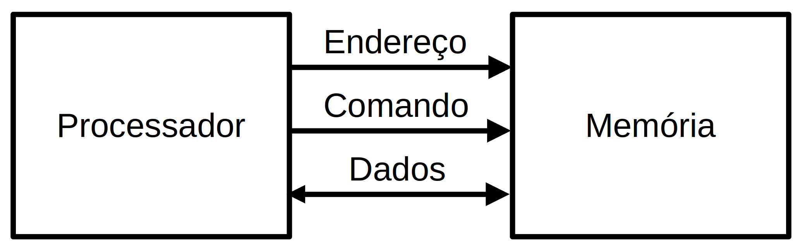
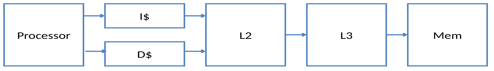
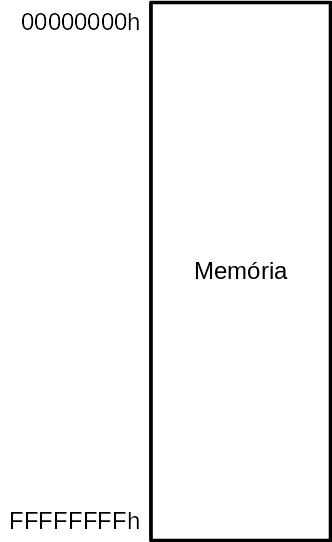
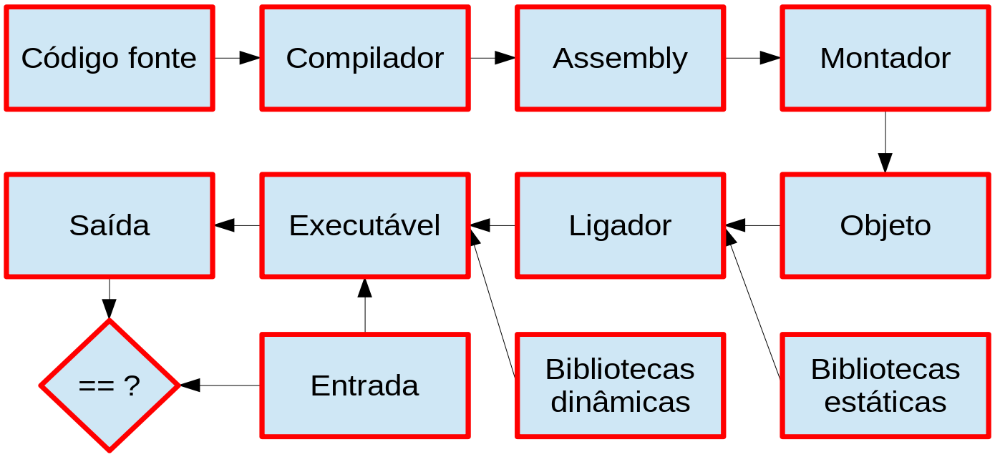
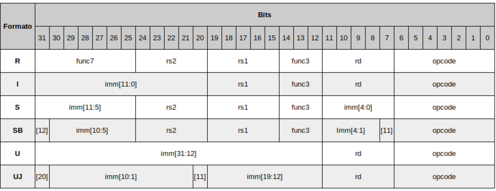

# Organização Básica de Computadores

Rodolfo Azevedo

MC404 - Organização Básica de Computadores e Linguagem de Montagem

http://www.ic.unicamp.br/~rodolfo/mc404

## Como funciona um computador?

## Quais os principais componentes de um computador?

* Processador
* Memória
* Periféricos

## O que um processador faz?

* Executa instruções
  * Codificadas em linguagem de máquina (binário)
  * Seguem um conjunto de instruções (ISA)
* Busca e escreve dados na memória
* Sabe onde está a próxima instrução a ser executada
* Lê e escreve dados nos periféricos
* Utiliza registradores como armazenamento temporário
* Considera o comportamento de uma instrução por vez
  * Pode ser capaz de executar múltiplas instruções, mas o comportamento final deve ser equivalente ao sequencial

## Ciclo de instrução

  * O processador tem um registrador especial, chamado **PC**, que indica onde está a próxima instrução na memória

### Para executar uma instrução, o processador:
  1. Solicita a leitura da memória enviando o endereço da instrução (PC)
  1. A memória envia o dado (instrução) para o processador
  1. O processador decodifica o dado como instrução
  1. O processador executa a instrução 

## O processador se comunica com a memória

* O processador não *sabe* exatamente o que tem do lado de fora dele, mas *sabe* claramente se comunicar com os componentes externos

  

* Basta enviar o endereço a ser acessado e utilizar um dos dois comandos disponíveis: **Leitura** ou **Escrita**.
* O dado será enviado caso o comando seja de escrita e será recebido caso o comando seja de leitura

## Mas a memória é muito lenta!

* O processador costuma ter **caches**, que nada mais são que memórias menores, mais rápidas, que ficam mais perto dele



* Caches são memórias **pequenas** que conseguem ser colocadas mais próximas do processador e que são mais rápidas que a memória principal
* Por que não fazer a memória principal do mesmo material que as caches?
  * Porque ela ficaria muito cara e de velocidade similar à memória principal atual

## O processador também tem registradores

* Registradores são pequenas células de memória que ficam dentro do processador
* O RISC-V prevê 32 registradores de 32 bits, onde um deles tem valor zero
* As instruções operam diretamente nos registradores, sem precisar acessar a memória
* Existem instruções específicas para ler e escrever dados da memória
  * **Load** faz a leitura de um valor na memória e coloca no registrador
  * **Store** faz a escrita na memória do valor de um registrador
* Existem múltiplas variações de load e store, que diferem no tamanho do dado e no endereçamento

## Como localizar um dado na memória?

* Todos os bytes de memória possuem um endereço
* A memória não usa o *espaço de endereçamento* disponível
* O processador precisa ler mais que um byte por vez
* No RISC-V, todas as leituras são feitas em múltiplos de palavras (4 bytes)



## Como ler um dado de 4 bytes?

* As instruções ocupam 4 bytes, então o PC sempre lê múltiplos de 4 bytes quando se trata de instruções
  * A primeira instrução está na posição 0, a segunda na posição 4, e assim sucessivamente
  * Isso significa que a primeira instrução, por ter 4 bytes, utiliza o byte 0, byte 1, byte 2 e byte 3


# Instruções de Memória

| Instrução  | Formato | Uso              | Significado          |
| ---------- | ------- | ---------------- | -------------------- |
| Load word  | I       | LW rd, imm(rs1)  | rd = Mem[rs1 + imm]  |
| Store word | S       | SW rs2, imm(rs1) | Mem[rs1 + imm] = rs2 |

* Existem variações para Byte (LB e SB) e Halfword (LH e SH)
* Também existem variações para Unsigned (LBU e LHU)

# Exemplo

Somar os dois primeiros elementos do vetor v e guardar na terceira posição do vetor

```c
main() {
  int v[10];
  ...
  v[2] = v[0] + v[1];
}
```

# Exemplo - resolvido

Somar os dois primeiros elementos do vetor v e guardar na terceira posição do vetor

```c
main() {
  int v[10];
  ...
  v[2] = v[0] + v[1];
}
```
  em assembly do RISC-V:

```mipsasm
lw t1, 0(t0)   # onde t0 deve ter o endereço de v[0]
lw t2, 4(t0)   # lê v[1] -> o próximo endereço após v[0]
add t3, t1, t2
sw t3, 8(t0)   # escreve em v[2]
```

# Tamanho de variáveis

| Linguagem C | Tipo em RISC-V (32 bits) | Tamanho em bytes |
| ----------- | ------------------------ | ---------------- |
| bool        | byte                     | 1                |
| char        | byte                     | 1                |
| short       | halfword                 | 2                |
| int         | word                     | 4                |
| long        | word                     | 4                |
| void        | unsigned word            | 4                |

> *char*, *short*, *int* e *long* também podem ser unsigned mantendo o tamanho

## Classificação de memórias

* As memórias podem ser classificadas em relação ao uso que se faz delas:
  * **Principal**: Fica próxima ao computador e armazena dados e programas para serem executados/utilizados
  * **Secundária**: Armazena dados e programas que precisam ser carregados para a memória principal para serem executados/utilizados.
* Elas também podem ser classificadas em relação à capacidade de reter dados:
  * **Voláteis**: Perdem os dados quando a energia é desligada
  * **Não voláteis**: Mantém os dados mesmo quando a energia é desligada

## Tipos de Memória

* **RAM**: Memória de acesso aleatório volátil. Utilizada como memória principal dos dispositivos computacionais. Tipicamente têm dois tipos:
  * **SRAM**: Memória estática, mais rápida mas mais cara. Geralmente utilizada em pequena quantidade (em registradores, caches)
  * **DRAM**: Memória dinâmica, mais lenta e mais barata. Geralmente utilizada em grande quantidade (memória principal), como DDR4 e DDR5
* **ROM**: Memória de acesso aleatório não volátil. Utilizada como memória secundária dos dispositivos computacionais. O caso mais comum é o da memória flash, a mesma do seu pendrive, mas que também serve para armazenar dados no seu celular e notebook (SSD).
* **Disco**: Para maiores quantidades de armazenamento, existem os discos rígidos (HDD).

## Revisando a organização da memória


* Seu programa é carregado do disco (ou SSD) para a memória principal (RAM)
* Todo programa só pode ser executado na memória principal
* A memória principal é endereçada em bytes mas, no caso do RISC-V, é acessada por palavras (4 bytes)

## Fluxo de desenvolvimento de código




## Ferramentas de desenvolvimento de código

* **Compilador**: Traduz o código fonte para assembly
* **Assembler** (ou montador): Traduz o assembly para código objeto
* **Linker** (ou ligador): Liga os arquivos de código objeto em um único executável
* **Debugger** (ou depurador): Ferramenta para depurar o código

É necessário padronizar os formatos de arquivos para que os programas possam se comunicar. Por exemplo, o formato de arquivos executáveis é o **ELF** (Executable and Linkable Format) para Linux. Para Windows, é o **PE** (Portable Executable).

## Exemplo de compilação

* Se você incluir a opção **-v** no comando de compilação:
  
```bash
gcc -v hello.c -o hello
```

* a saída indicará os comandos executados:

```bash
/usr/lib/gcc/x86_64-linux-gnu/11/cc1 -quiet -v -imultiarch x86_64-linux-gnu hello.c -quiet -dumpbase hello.c 
  -dumpbase-ext .c -mtune=generic -march=x86-64 -version -fasynchronous-unwind-tables -fstack-protector-strong 
  -Wformat -Wformat-security -fstack-clash-protection -fcf-protection -o /tmp/ccKSK8pI.s
as -v --64 -o /tmp/ccT0vpIO.o /tmp/ccKSK8pI.s
/usr/lib/gcc/x86_64-linux-gnu/11/collect2 -plugin /usr/lib/gcc/x86_64-linux-gnu/11/liblto_plugin.so 
  -plugin-opt=/usr/lib/gcc/x86_64-linux-gnu/11/lto-wrapper -plugin-opt=-fresolution=/tmp/cclVYMhX.res 
  -plugin-opt=-pass-through=-lgcc -plugin-opt=-pass-through=-lgcc_s -plugin-opt=-pass-through=-lc 
  -plugin-opt=-pass-through=-lgcc -plugin-opt=-pass-through=-lgcc_s --build-id --eh-frame-hdr 
  -m elf_x86_64 --hash-style=gnu --as-needed -dynamic-linker /lib64/ld-linux-x86-64.so.2 -pie -z now 
  -z relro -o hello /usr/lib/gcc/x86_64-linux-gnu/11/../../../x86_64-linux-gnu/Scrt1.o 
  /usr/lib/gcc/x86_64-linux-gnu/11/../../../x86_64-linux-gnu/crti.o /usr/lib/gcc/x86_64-linux-gnu/11/crtbeginS.o 
  -L/usr/lib/gcc/x86_64-linux-gnu/11 -L/usr/lib/gcc/x86_64-linux-gnu/11/../../../x86_64-linux-gnu 
  -L/usr/lib/gcc/x86_64-linux-gnu/11/../../../../lib -L/lib/x86_64-linux-gnu -L/lib/../lib 
  -L/usr/lib/x86_64-linux-gnu -L/usr/lib/../lib -L/usr/lib/gcc/x86_64-linux-gnu/11/../../.. /tmp/ccT0vpIO.o 
  -lgcc --push-state --as-needed -lgcc_s --pop-state -lc -lgcc --push-state --as-needed -lgcc_s 
  --pop-state /usr/lib/gcc/x86_64-linux-gnu/11/crtendS.o /usr/lib/gcc/x86_64-linux-gnu/11/../../../x86_64-linux-gnu/crtn.o
```

## E quanto aos periféricos?

* Do ponto de vista do processador, periféricos são apenas outros itens acessados numa região específica de memória
* O processador não sabe se o dado está na memória principal ou em um periférico
  * O processador sabe apenas enviar um endereço e um comando de leitura
  * Se o endereço corresponder à memória, a memória será ativada e retornará o dado
  * Se o endereço corresponder a um periférico, o periférico será ativado e retornará o dado
* Quem tem essa informação é o programador
* O periférico pode ficar atrás da proteção do sistema operacional assim como o sistema de memória

## RISC vs CISC

* O conjunto de instruções de um processador pode ser complexo ou simples
  * CISC: Complex Instruction Set Computer
  * RISC: Reduced Instruction Set Computer
* Esse conceito foi mudando um pouco com o tempo, hoje temos ISAs RISC com muitas instruções e com um bom grau de complexidade
* Arquiteturas RISC são baseadas em modelos load/store onde todo o acesso à memória só se dá através de instruções explicitas
* É comum arquiteturas RISC possuírem mais registradores
* É comum arquiteturas CISC possuírem instruções com mais sub-ações
* É comum arquiteturas CISC serem implementadas total ou parcialmente com microinstruções

## Multicore vs Multithread

* **Multicore**: Processadores com múltiplos núcleos
  O modelo de fabricação inclui mais de uma unidade de processamento (núcleo) independente dentro do processador. Assim temos processadores de 4 núcleos, 8 núcleos, etc. Cada um funciona como um processador independente, mas compartilham a mesma memória principal.
* **Multithread**: Processadores capazes de executar múltiplas threads
  Um programa precisa de, no mínimo, uma thread. Essa é a menor unidade de execução possível. Um núcleo de processador pode ser capaz de executar multithread, o que significa que ele é capaz de executar múltiplas threads simultaneamente.

> Nenhum programa de MC102 que você fez era multithread! :astonished:

## Codificação das instruções

* Cada instrução precisa ser codificada em uma sequência de bits para que o processador consiga identifica-la
* Para fins dessa disciplina e a versão do processador RISC-V que estamos utilizando, todas as instruções são codificadas em 32 bits
* Deve ser possível, em 32 bits, codificar a instrução, os registradores e o imediato sempre que necessário
* Algumas decisões de projeto são necessárias para conseguir cumprir esse requisito

## Formato de instruções



## Agora que você já sabe os formatos de instruções

* Entendeu que há um limite no número total de registradores (32)?
* Entendeu que há um limite no número máximo de registradores que uma instrução pode utilizar?
* Entendeu que há um limite no tamanho do imediato para as instruções?
